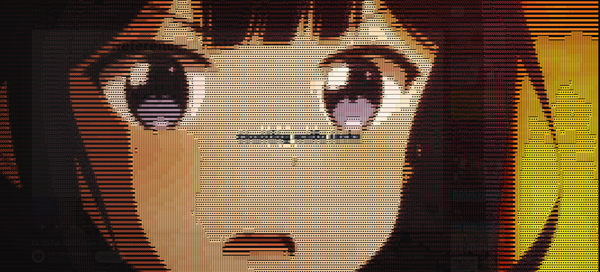

# ASCII Video Player



# Table of Contents
- [Introduction](#introduction)
- [Dependencies](#dependencies)
- [How to compile](#how-to-compile)
- [How to run](#how-to-run)
  - [Video to ASCII Art](#video-to-ascii-art)
    - [Options](#options)
  - [Image to ASCII Art](#image-to-ascii-art)
    - [Options](#options-1)
- [Building from source](#building-from-source)
  - [Requirements](#requirements)
    - [Optional](#optional)
  - [Building](#building)


# Introduction
This program converts images or videos to colored ASCII art. It uses the in house methods from this directory to create the ASCII art. The characters used for the ASCII art are calculated by using the [create_characters.py](create_characters.py) script with the [create_ascii_darkmap.py](create_ascii_darkmap.py) script. The characters are then stored in the [ascii_darkmap.dat](ascii_darkmap.dat) file. The [img2ascii.py](img2ascii.py) and [video2ascii.py](video2ascii.py) scripts use the [ascii_darkmap.dat](ascii_darkmap.dat) file to convert images or videos to ASCII art. If you don't have the [ascii_darkmap.dat](ascii_darkmap.dat) in your directory, the programs will not work.

# Dependencies and Requirements
- Python 3.8+
- numpy
- ffmpeg [for the video to ASCII converter] (you will need to have the ffmpeg executable in your PATH environment)
- ffplay [for the video to ASCII converter] (you will need to have the ffplay executable in your PATH environment for audio playback)

To install the dependencies, run the following command:
```shell
pip install -U numpy
```

# How to compile
You will need a compiler for C. On Windows, this is the [Microsoft Visual C++ Build Tools](https://visualstudio.microsoft.com/visual-cpp-build-tools/).

Run the following command to compile the program:
```shell
python "C_Funcs/setup.py" build_ext --inplace
```

# How to run

## Video to ASCII Art
First, make sure you have installed the dependencies and have [compiled the C functions](#how-to-compile).
Then you can run the ASCII video player by running the following command:
```shell
python video2ascii.py <video path> [options]
```

### Options
- `-h`: Show help message and exit
- `-d`, `--debug`: Show debug information (default: False)
- `-m <max_chars>`, `--max-chars <max_chars>` : Maximum number of characters to display (default: 32500)
- `--no-ascii`: Don't use ascii characters to represent the video (default: False)
- `--no-color`: Don't use color in the output (default: False)
- `-r <fps>`, `--fps <fps>`: Frames per second. The framerate to play the video back at (default: video's framerate)
- `-s <width>:<height>`: Size of the output video. Should be input as "width:height" with no spaces and numbers only. A negative one (-1) in any of the sizes will calculate the best size to maintain the image ratio (default: 250:-1)
- `-ss`: Start at the specified time in the video in seconds. (default: 0)
- `-t <tempo>`, `--tempo <tempo>` : Tempo of the output video (ex. 1x speed, 2x speed, 1.75x speed) (default: 1)
- `--ffmpeg [...]`: All commands after this will be passed to ffmpeg video decoder. See [ffmpeg documentation](https://ffmpeg.org/ffmpeg.html) for more information (default: None)

## Image to ASCII Art
Then you can run the image to ASCII art converter by running the following command:
```shell
python img2ascii.py <image path> [options]
```

### Options
- `-h`: Show help message and exit
- `-f <freq>`, `-c <freq>`: Color frequency. The higher the integer, the higher threshold for changing color. (default: 1)
- `-s <width>:<height>`: Size of the output image. Should be input as "width:height" with no spaces and numbers only. A negative one (-1) in any of the sizes will calculate the best size to maintain the image ratio (default: 266:-1)
- `--no-ascii`: Don't use ascii characters to represent the image (default: False)
- `--no-color`: Don't use color in the output (default: False)

# Building from source
Building the executable from source probably only works on Windows. That's why there is only the windows executable available.
There may or may not be a performance increase when using the executable instead of the python scripts. I haven't done enough tests to prove statistical significance.
It is recommended to use Python 3.11 for building because it has proven to make the fastest executable.

## Requirements
- Python 3.8+
- nuitka
- numpy
- suitable C compiler (Microsoft Visual C++ Build Tools on Windows)

Install the python dependencies by running the following command:
```shell
pip install -U nuitka numpy
```

### Optional
- [upx](https://github.com/upx/upx/tree/devel) (for compressing the executable and other files) (recommended)

## Building
Make sure you have first built the C functions locally as described in the [How to compile and run](#how-to-compile) section.
Run the following command to build the executable:

```shell
build.bat
```

By default, it will try to compress all the files heavily with the `--ultra-brute` option and will take a long time. If you don't want that to happen, change the `COMPRESS_FLAGS` in the [build.bat](build.bat) file to `--brute`, `--best`, or whatever you want.